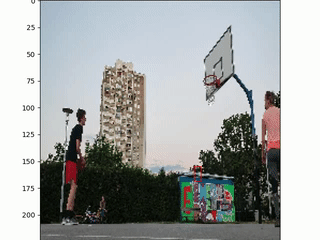
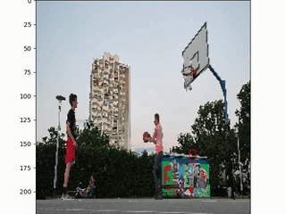

# BasketPredictor

### Overview
An app which solves problem of object localization of a ball on videos of me shooting on basket. Results are given below:

 

### Details and results
Problem is solved using deep neural net 
with a backbone [ConvNeXt](https://arxiv.org/abs/2201.03545) on which was added a couple of dense layers as Head with the sigmoid as final activation.
The output od model are 4 number representing `x1`, `x2`, `y1` and `y2` coordinates. Backbone was not pretrained, weights were randomly initialized 
coming from normal distribution. Training was done on one GPU and lasted around 1-2 hours. Dataset was annotated by me.

My goal was to also implement hyperas and autokeras libraries in my model to perform NAS and some HPO, but I did not succeed in that. Those libraries 
seemed incompatible with newer architectures, at least thats how I interpreted it.

I used mIOU as metric, and as it can be seen on the results I didnt get perfect results. My biggest test mIOU was around 0.65, but I am pretty
satisfied with the results.

### Usage
Clone the repo: 
```
https://github.com/babotrojka/BasketPredictor.git
```
Install reqs preferably in a conda env:
```
pip install -r requirements.txt
```

Create and structure dataset like this:
```
dataset
|___train
|   | frame_0001.jpg
|   | frame_0001.json
|   | ...
|
|___val
|
|___test
```
JSON file looks like this:
```
"bbox": [0.4287037037037037, 0.19166666666666668, 0.4962962962962963, 0.23333333333333334]}
```
Dataset folder should be situated in the parent folder of the repo or in `train.py` `DATASET_ROOT` could be updated to a new dataset root.

Training can then be started with:
```
python train.py
```

### TODOs and ideas
My idea was also to implement video classification in the classes marking if the basket was scored or not. The idea was to use 
[Transformer](https://keras.io/examples/vision/video_transformers) architecture. Unfortunately, other projects and obligations came along...
